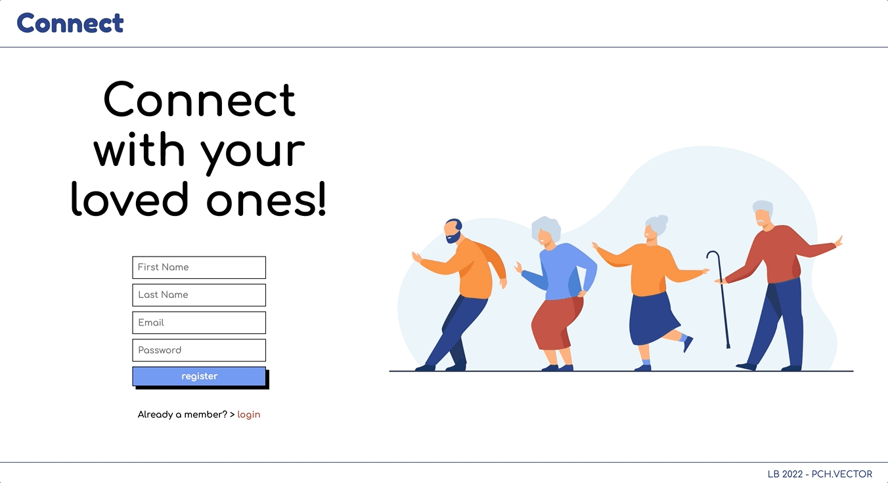
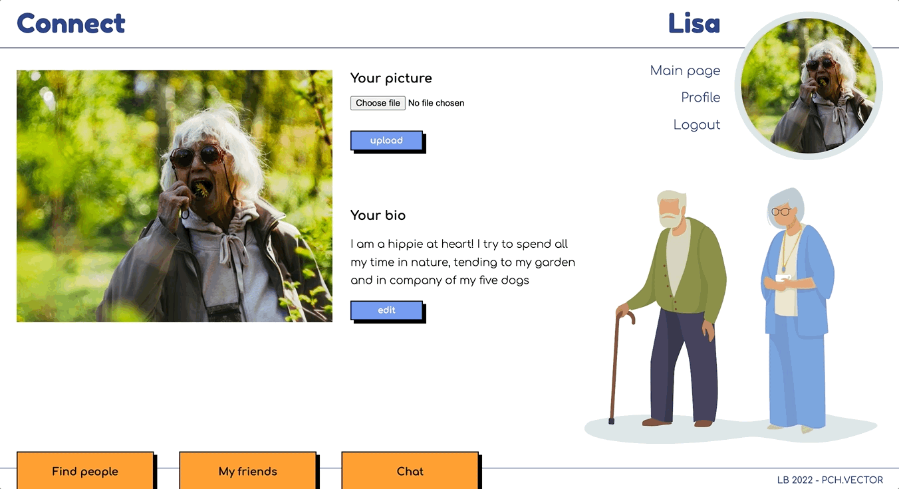
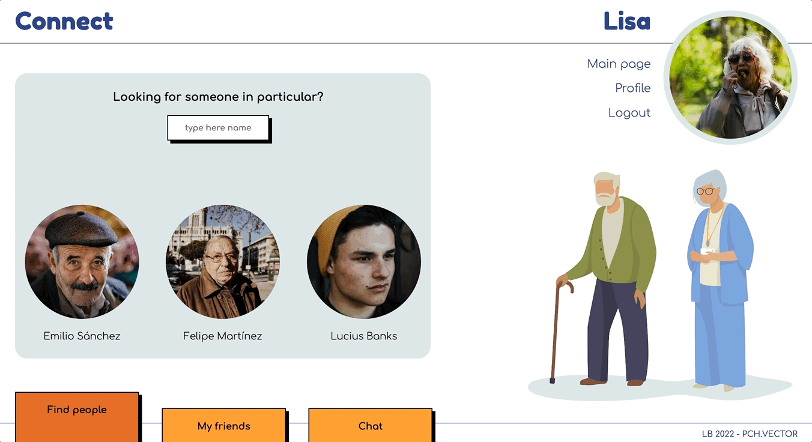
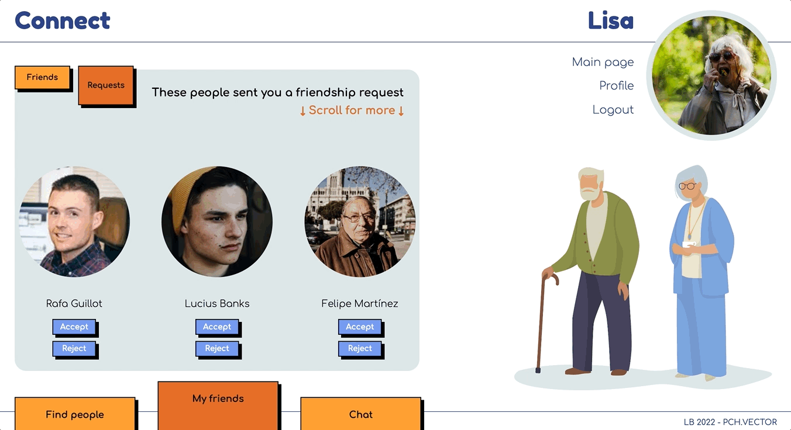

# connect

*project done during the SPICED academy Full Stack Web Development bootcamp*  

## overview  
Connect is an easy-to-use intergenerational social platform. The design is simple and clean, in order to make it accesible to people of all ages.

- Registration and Login page with error display
- Bcrypt for password protection
- Password update via a code sent by email in case of forgetting
- Picture upload and bio always updatable in the user profile
- Friend search tool
- People can be befriended and unfriended
- Chat

Note: This website is not yet optimised for small screens, please take a look on a laptop or a bigger screen.  

## previews  

**register & login page**  
minimalistic approach with all basic functionalities and error displays

**profile update**  
profile picture and bio can be changed anytime

**friends search**  
acquaintances suggestion and search by name, button changes functionality after sending a request

**befriend / unfriend**  
a place to find all friends and requests

**chat**  
group chat supported by socket-io

